# PokeTokenBar

App de barra de menú para macOS que convierte el consumo de tokens de la API de
Anthropic en combates Pokémon estilo retro. **1 token = 1 punto de daño.**
Cuando el rival llega a 0 HP se captura, entra en tu caja PC y aparece otro.

```
 [ Typhlosion vs Diglett ]  37.3k/42.8k
```

<p align="center">
  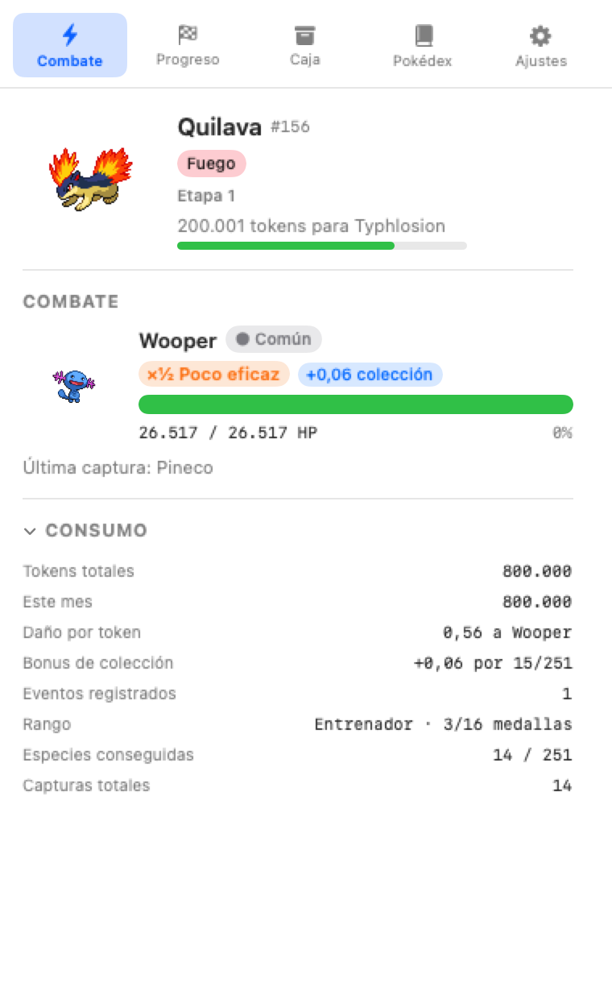
  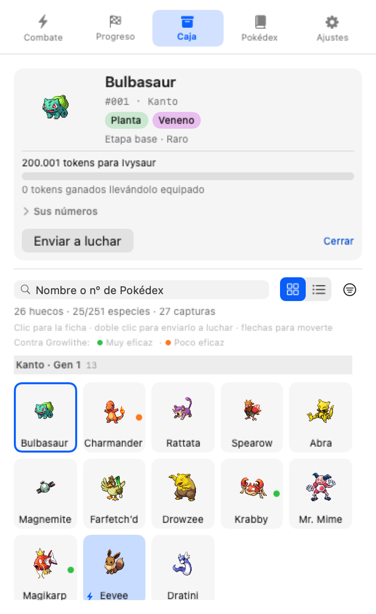
</p>
<p align="center">
  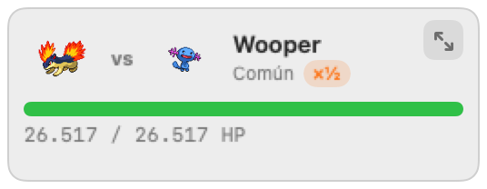
  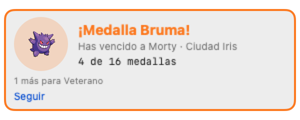
</p>

> Las capturas salen de `--render-ui` (ver §10) y por tanto son reproducibles.
> Incluyen sprites propiedad de **Nintendo/Game Freak**, a título ilustrativo:
> no están cubiertos por la licencia MIT de este repo.

---

## 1. Arquitectura

Tres capas, con el juego aislado de AppKit para que sea comprobable sin UI:

```
┌──────────────────────── PokeTokenBar (app target) ─────────────────────────┐
│  Entry ─▶ AppDelegate ─▶ StatusItemController ─▶ NSPopover(SwiftUI)        │
│                │                    ▲                                     │
│                │  TokenSourceCoordinator      SpriteStore (caché en disco) │
└────────────────┼───────────────┬───────────────────────────────────────────┘
                 │               │ UsageEvent
┌────────────────▼───────────────▼──── PokeTokenBarCore (librería) ──────────┐
│  Ingest      ClaudeCodeTranscriptSource   IngestServer (127.0.0.1:8317)    │
│  Store       GameStore  ──────────────▶  StateFileStore (JSON atómico)     │
│  Engine      BattleEngine · SpawnService · EvolutionService · RandomProvider│
│  Data        Pokedex  ◀── Resources/pokedex.json (#1-#251, generado)       │
└────────────────────────────────────────────────────────────────────────────┘
```

Flujo de un evento:

```
usage de la API ─▶ TokenSource ─▶ GameStore.ingest(UsageEvent)
                                    │  ¿id ya visto? ─▶ descartar
                                    ├─ ledger.record(tokens)
                                    ├─ BattleEngine.apply(damage:)
                                    │     └─ HP 0 ─▶ captura ─▶ SpawnService.spawn()
                                    └─ persist() (debounce 700 ms)
```

Decisiones que importan:

- **El motor no sabe nada de AppKit.** `PokeTokenBarCore` es Foundation puro,
  así que el juego entero se prueba sin abrir una ventana.
- **El RNG es una dependencia** (`RandomProvider`). En producción es
  `SystemRandomProvider`; en tests, `SeededRandomProvider` (SplitMix64), lo que
  permite verificar los ratios de aparición con 200.000 muestras deterministas.
- **La idempotencia vive en el store, no en las fuentes.** Cada `UsageEvent`
  trae un id estable (`requestId` del transcript, `id` del proxy). Las fuentes
  pueden solaparse, reintentar o releer un fichero sin duplicar daño.
- **La app nunca ve tu API key.** No intercepta el proceso ni proxea tráfico:
  o lee los transcripts que Claude Code ya escribe, o recibe un `usage` ya
  contabilizado en un endpoint de loopback.
- **Escritura atómica y estado en cuarentena.** `state.json` se escribe con
  `replaceItemAt`; si aparece corrupto se aparta con sufijo `.corrupt-<epoch>`
  en vez de perderse en silencio.

## 2. Modelo de datos

`Sources/PokeTokenBarCore/Resources/pokedex.json` (generado, 251 entradas):

```jsonc
{
  "id": 147, "name": "Dratini", "localizedName": "Dratini", "slug": "dratini",
  "generation": 1, "types": ["dragon"],
  "baseStatTotal": 300, "captureRate": 45,
  "rarity": "rare",            // tier de aparición
  "stage": 0,                  // distancia a la forma base (0-2)
  "baseFormID": 147,
  "evolvesInto": [148],        // varias si la cadena bifurca (Eevee: 5)
  "isLegendary": false, "isStarter": false
}
```

Estado persistido en `~/Library/Application Support/PokeTokenBar/state.json`
(`schemaVersion: 2`; la migración desde 1 acredita al compañero equipado los
tokens acumulados desde su captura, que es quien los había estado ganando):

```jsonc
{
  "schemaVersion": 1,
  "ledger": { "total": 5500, "monthly": { "2026-09": 5500 }, "eventCount": 2 },
  "box": [{ "id": "<uuid>", "speciesID": 4, "isShiny": false,
            "capturedAt": "...", "capturedAtTotalTokens": 0,
            "evolutionSeed": 12345, "tokensEarned": 289253 }],
  "activeCompanionID": "<uuid>",
  "encounter": { "speciesID": 50, "rarity": "common", "isShiny": false,
                 "maxHP": 42814, "currentHP": 37314, "spawnedAt": "..." },
  "settings": { "countCacheTokens": false, "watchClaudeCodeTranscripts": true,
                "ingestServerEnabled": true, "ingestPort": 8317 },
  "processedEventIDs": ["ingest:req_1"]
}
```

`evolutionSeed` fija la rama evolutiva de por vida: tu Eevee siempre evoluciona
al mismo sitio, aunque la cadena tenga cinco salidas.

## 3. Reglas

**El inicial no se elige: cada región regala el suyo al llegar**, como el
profesor de su pueblo. Kanto (la región 1) da **Charmander** y Johto da
**Cyndaquil**, así que abrir la región 2 trae su inicial igual que trae sus
zonas y sus gimnasios — y hasta que aparezca una tercera región no hay ninguno
más que esperar.

Antes había una pantalla para elegir entre los seis clásicos, y sobraba por dos
motivos: no era una decisión (lo que decide un combate es el cruce de tipos del
rival de turno, no con quién empezaste) y ofrecía los tres de Johto para empezar
en Kanto. Nunca duplica una línea: si ya tienes ese Pokémon, no te dan otro.


| Tier | Prob. | HP | Requiere | Ejemplos |
|---|---|---|---|---|
| Común | 60 % | 10.000 – 50.000 | — | Rattata, Sentret |
| Poco común | 28 % | 75.000 – 200.000 | — | Gastly, Scyther |
| Raro | 10 % | 250.000 – 600.000 | > 200.000 tokens | Dratini, Larvitar, iniciales |
| Legendario | 2 % | 1.500.000 – 4.000.000 | > 2.000.000 tokens | Mewtwo, Lugia |

- Variocolor (shiny): 1 % en cualquier aparición, y se conserva al capturar.
- Un tier bloqueado no "reintenta": su peso se reparte entre los disponibles.
### Evolución: los tokens dan derecho, el combate decide la forma

Cada Pokémon evoluciona con **sus** tokens (200.000 y 1.000.000 ganados
estando equipado), y la evolución es un **hecho que se registra en el
ejemplar**, no algo que se recalcule a partir de los tokens. Eso importa para
las cinco líneas que bifurcan: antes la rama la fijaba una semilla desde la
captura —te tocaba la que te tocaba— y ahora la decide **lo último que vence al
evolucionar**, más la hora que sea.

Las condiciones salen del canon, traducidas a lo que este juego tiene (no hay
piedras, ni amistad, ni intercambios; hay reloj y rivales con tipo):

| Línea | Rama | Condición | Canon |
|---|---|---|---|
| Eevee | Vaporeon | vencer un rival de tipo **agua** | Piedra Agua |
| | Jolteon | rival **eléctrico** | Piedra Trueno |
| | Flareon | rival **fuego** | Piedra Fuego |
| | Espeon | **de día** (6:00–19:59) | amistad + día |
| | Umbreon | **de noche** (20:00–5:59) | amistad + noche |
| Gloom | Bellossom / Vileplume | día / noche | Piedra Solar / Piedra Hoja |
| Poliwhirl | Poliwrath / Politoed | rival de agua / lo demás | Piedra Agua / Roca del Rey |
| Slowpoke | Slowbro / Slowking | día / noche | nivel / Roca del Rey |
| Tyrogue | Hitmonlee / Hitmonchan / Hitmontop | mañana / tarde / noche | Ataque >, <, = Defensa |

**El tipo manda sobre el reloj**: si no, de noche no habría manera de sacar a
Vaporeon. Así el reloj es el camino por defecto y el tipo es el que se busca a
propósito — y para eso está la zona enfocada (§13).

Y como una línea solo se captura una vez, para las otras ramas hay una
excepción a esa regla: **puedes capturar otro ejemplar de una línea que bifurca
mientras te falte alguna de sus ramas y los que ya tienes estén al final de su
evolución**. Es decir: evolucionas tu Eevee y entonces puede volver a aparecer
otro. De una línea recta (Squirtle) nunca podrás tener dos.

Con eso, las **15 ramas de las cinco líneas son alcanzables** y la Pokédex sube
de 242 a los 251 completos. La ficha canta la condición ("ahora mismo sería
Espeon", con lo último vencido y qué falta para cada rama) y la barra de menú
enseña ☀ o ☾ **solo cuando la hora está decidiendo algo**: el equipado ya puede
evolucionar y su rama depende de la banda.

**Una evolución que cruza de región espera a esa región**, y con Kanto delante
eso son **las once evoluciones que en el canon no existían hasta Gen 2**: un
Onix no puede ser **Steelix** hasta abrir Johto, ni Golbat **Crobat**, ni
Chansey **Blissey**, ni Scyther **Scizor**, ni Seadra **Kingdra**, ni Poliwhirl
**Politoed**, ni Gloom **Bellossom**, ni Slowpoke **Slowking**, ni Porygon
**Porygon2**, ni Eevee **Espeon** o **Umbreon**.

Cuando la rama que toca está bloqueada, **espera**: no cae a otra, que sería dar
la que no se pidió. Un Eevee de noche antes del barco no se convierte en
Vaporeon por descarte; se queda Eevee hasta que abras Johto, o hasta que venzas
un rival de agua, fuego o eléctrico.

Solo bloquea cuando **cruza**. La versión estricta —"nada de una región cerrada
evoluciona"— congelaría casi todas las líneas de Johto que se capturan en las
rutas de Kanto, y eso no es una regla, es un muro. Un Hoothoot capturado en
Kanto evoluciona a Noctowl sin problema: su línea ya es de Johto.

La regla está escrita en términos de **regiones abiertas**, no de generaciones,
así que valía igual con el orden inverso: allí tocaba a los ocho bebés de Johto
(Pichu, Cleffa, Igglybuff, Tyrogue ×2, Smoochum, Elekid y Magby), que es un
puñado de casos mucho menos interesante — y por eso se invirtió el orden.

Detalle a tener en cuenta: si el ejemplar cruza el umbral durante un combate de
jefe —donde no hay salvajes—, la rama la decide el último salvaje que venciste,
que puede ser de hace rato. La ficha lo dice ("último vencido: X"), así que no
es una sorpresa.

### Efectividad por tipos

El daño se multiplica por el cruce de tipos entre tu compañero y el rival:
agua contra fuego ×2, fuego contra agua ×0,5, roca contra fuego/volador ×4.

- El compañero **ataca con su mejor tipo**: Bulbasaur (planta/veneno) contra
  agua usa planta (×2), no veneno (×1).
- Los tipos del defensor **multiplican** entre sí, así que el rango real va de
  ×0,25 a ×4.
- Una **inmunidad** (Normal contra Fantasma) no atasca el combate: cae al suelo
  de ×0,25 en vez de a 0, para que ningún token quede sin efecto.
- El **ledger sigue contando tokens reales**; lo que escala es el HP que
  quitas. Son dos magnitudes distintas: 1.000 tokens con ×2 son 1.000 tokens
  gastados y 2.000 HP de daño.
- Al capturar en cadena, los tokens que sobran se re-escalan con el
  multiplicador del **rival nuevo**, que puede ser otro tipo.
- Se puede apagar desde el popover (vuelve a 1 token = 1 HP).

La tabla se genera de PokeAPI (`tools/generate_typechart.mjs`) e incluye Hada:
la Pokédex embebida trae los tipos actuales, así que Clefairy, Togepi o Marill
son Hada aunque en Gen 1 y 2 no existiera ese tipo.

- **Las cadenas cuya raíz es una cría posterior sí enlazan.** Azurill y Happiny
  son de Gen 3 y 4, así que caen fuera del #1-251; el generador descartaba la
  cadena entera por eso y dejaba a Marill sin su Azumarill y a Chansey sin su
  Blissey. Ahora la forma base es el **primer miembro dentro de rango** del
  camino, y hay tests que fijan el invariante.
- Los tiers salen de los datos de PokeAPI (legendario/mítico, `capture_rate` y
  mejor BST de la familia), no de una lista a mano. La regla está en
  `tools/generate_pokedex.mjs`.
- **La colección da poder.** Cada hueco de la Pokédex suma daño contra
  salvajes: `especies / 251`, hasta `+1,0`. La caja deja de ser decoración y
  capturar pasa a ser inversión. **Solo cuenta contra salvajes**: si contara
  contra jefes, una Pokédex avanzada anularía su absorción y dejarían de ser un
  problema de cobertura de tipos para ser uno de acumulación.
- **La evolución es de cada Pokémon, no del jugador.** Cada capturado acumula
  `tokensEarned`: los tokens gastados **mientras lo llevabas equipado**. Los
  umbrales son los del spec (base ≤ 200.000 · etapa 1 200.001–1.000.000 ·
  etapa 2 > 1.000.000) pero aplicados a ese contador propio.
  - Un Pineco capturado hoy sigue siendo Pineco aunque lleves 300.000 tokens:
    esos los ganó otro.
  - El progreso **solo crece**, así que una evolución conseguida no se pierde
    al cambiar de compañero: puedes tener Wartortle y Marowak evolucionados a
    la vez en la caja.
  - Las líneas de dos formas se quedan en su última forma.
- El daño sobrante de una captura se arrastra al rival siguiente: ningún token
  se pierde, y un evento grande puede encadenar varias capturas.

## 4. HUD flotante

<p align="center">
  
  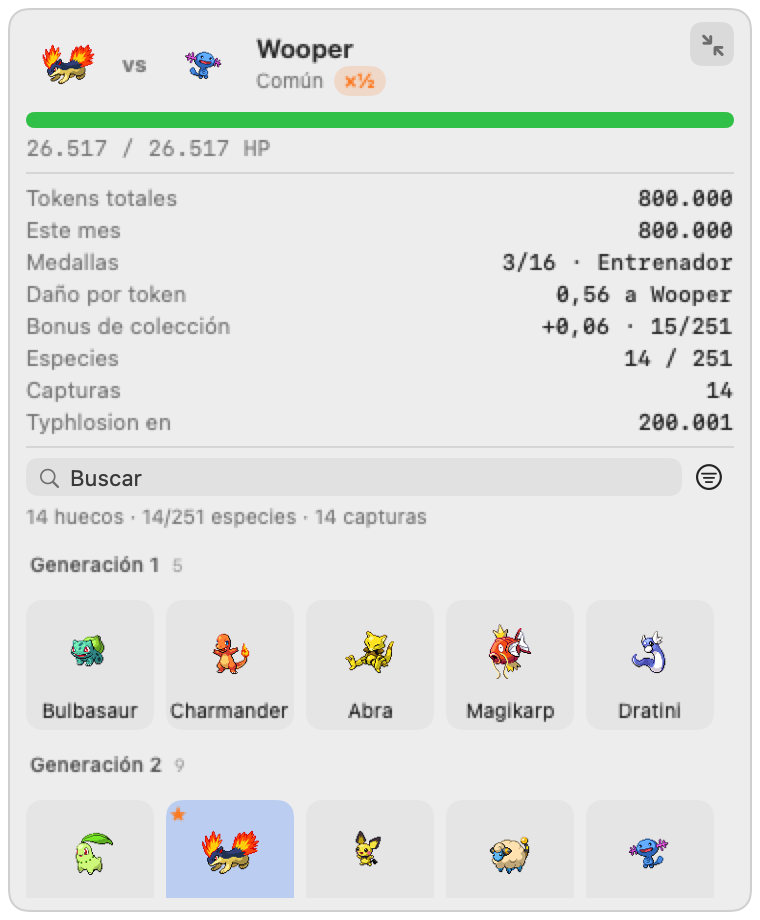
</p>

Además del ítem de la barra de menú, la app puede mostrar un HUD anclado a una
esquina: fondo transparente, sin bordes, sin sombra y **click-through**
(`ignoresMouseEvents`), así que nunca roba foco ni tapa nada con lo que quieras
interactuar. Vive en todos los escritorios y sobre apps a pantalla completa.

Colocación:
- **Anclado a una esquina** (por defecto): se dibuja una ventana *por pantalla*,
  porque con varios monitores anclarlo solo a la principal lo deja donde no
  estás mirando.
- **Arrastrado a mano**: al moverlo se guarda la posición y pasa a haber una
  sola ventana. Si desconectas ese monitor, vuelve al anclaje por esquina en
  vez de quedarse en el limbo.

Tamaño (las cifras salen de `HUDController`, no de la memoria: 268×104 base,
umbrales 140 y 248, techo 620×760):
- compacto **268×104**, solo el combate. Crece con el multiplicador de sprites:
  a ×2 son 352×146, para que el pixel art grande siga cabiendo;
- arrastrando cualquier borde crece y va revelando contenido por altura: a
  partir de **140 px** las **métricas de consumo** (tokens totales, este mes,
  medallas, daño por token, especies, capturas y lo que falta para la siguiente
  evolución) y a partir de **248 px** la **caja PC** completa, con su búsqueda,
  sus filtros y sus tramos (rejilla adaptativa: más ancho = más columnas). El
  botón de la esquina despliega/pliega a **380×460** sin buscar el borde, que en
  una ventana sin marco no se ve, y al plegar cierra la ficha y la caja. Acotado
  a **620×760** y persistido.

**El panel no se agranda solo:** crecer y plegarse es cosa del botón, no de un
clic. El botón va **encima de la esquina de arriba a la derecha**, mide 22×22
tanto plegado como desplegado, y lo único que cambia son las flechas (hacia
fuera para desplegar, juntándose para plegar). El hueco lo reserva **solo la
primera fila**: la barra de HP, las métricas y la rejilla van a todo el ancho.
Está en los cuatro paneles (combate, gimnasio, hito y liga); antes era un icono
dentro de la cabecera del combate salvaje, así que en los paneles de jefe no
había ninguno y en el compacto competía por el ancho con el nombre del rival.
También está en el menú contextual. Con el HUD plegado, un clic en un sprite abre la ficha en el popover, que
es donde hay sitio. El botón de plegar está ahora en los cuatro paneles —
combate, gimnasio, hito y liga: en los tres últimos no había ninguno, así que
durante una liga o un hito no había manera visible de desplegar el HUD.

Estados de ratón:
- desbloqueado (por defecto): se arrastra y su **menú contextual** (clic
  derecho) lleva a la caja PC para cambiar de compañero, cierra la caja, y
  permite recolocarlo, bloquearlo, ocultarlo o salir — sin depender del ítem de
  la barra de menú. El menú **no enumera Pokémon**: listaba los 8 últimos, y con
  la caja llena eso ni cabe ni se busca. "Ocultar el HUD" dice de dónde vuelve
  (Ajustes), porque el menú vive en el propio HUD y su única vuelta está en otra
  pantalla;
- bloqueado: click-through, se ve pero no recibe clics.

Mientras no haya compañero elegido el HUD muestra el selector de inicial y
siempre acepta clics: es la entrada al juego cuando la barra de menú está tan
llena que macOS oculta el ítem (frecuente en pantallas con notch).

## 5. Puesta en marcha

```bash
git clone <este repo> && cd poketokenbar
./scripts/bundle.sh              # compila en release y arma dist/PokeTokenBar.app
open dist/PokeTokenBar.app       # o: cp -R dist/PokeTokenBar.app /Applications/
```

Requisitos: macOS 13+ y Swift 6.x (las Command Line Tools bastan; no hace falta
Xcode). Al primer arranque eliges inicial entre los seis de Gen 1 y Gen 2.

Para desarrollar: `swift run PokeTokenBar` (el status item funciona igual sin
empaquetar, pero sin `LSUIElement` aparece en el Dock).

### Abrir junto a Claude Code

Un hook `SessionStart` en `~/.claude/settings.json` la levanta si no está ya
corriendo (el `pgrep` la hace idempotente, y el `|| true` evita que un fallo
bloquee la sesión):

```json
{
  "hooks": {
    "SessionStart": [{
      "hooks": [{
        "type": "command",
        "command": "pgrep -f 'PokeTokenBar.app/Contents/MacOS/PokeTokenBar' >/dev/null || open -ga /Applications/PokeTokenBar.app 2>/dev/null || true",
        "timeout": 10
      }]
    }]
  }
}
```

Autoarranque al iniciar sesión (alternativa, independiente de Claude):

```bash
cat > ~/Library/LaunchAgents/dev.poketokenbar.plist <<'PLIST'
<?xml version="1.0" encoding="UTF-8"?>
<!DOCTYPE plist PUBLIC "-//Apple//DTD PLIST 1.0//EN" "http://www.apple.com/DTDs/PropertyList-1.0.dtd">
<plist version="1.0"><dict>
  <key>Label</key><string>dev.poketokenbar</string>
  <key>ProgramArguments</key>
  <array><string>/Applications/PokeTokenBar.app/Contents/MacOS/PokeTokenBar</string></array>
  <key>RunAtLoad</key><true/>
</dict></plist>
PLIST
launchctl load ~/Library/LaunchAgents/dev.poketokenbar.plist
```

## 6. De dónde salen los tokens

### a) Transcripts de Claude Code (activo por defecto, cero configuración)

Sigue `~/.claude/projects/**/*.jsonl` y lee `message.usage` de cada línea. En el
primer arranque se coloca al final de cada fichero, así que no te vuelca meses
de historial sobre el primer Rattata.

### b) Proxy de la API (para tu propio código)

```bash
node tools/anthropic-proxy.mjs
export ANTHROPIC_BASE_URL=http://127.0.0.1:8318
```

Reenvía a `api.anthropic.com` tal cual —streaming SSE incluido— y reporta el
`usage` a la app. Las cabeceras de autenticación se reenvían sin leerse ni
registrarse.

### c) Reportar a mano desde cualquier sitio

```bash
curl -X POST http://127.0.0.1:8317/usage \
  -H 'content-type: application/json' \
  -d '{"id":"req_123","model":"claude-opus-5",
       "usage":{"input_tokens":4000,"output_tokens":1000}}'
```

`id` es la clave de idempotencia: repetir la misma petición no hace más daño.
El servidor escucha solo en `127.0.0.1` y expone tres rutas: `GET /` (una
página que explica qué es esto, por si abres el puerto en el navegador),
`GET /health` y `POST /usage`.

Los tokens de caché (`cache_creation_input_tokens`, `cache_read_input_tokens`)
**no** cuentan por defecto: en sesiones largas dominan el total y desequilibran
el combate. Hay un check en el popover para incluirlos.

## 7. Overrides por entorno

Útiles para probar contra una partida desechable sin tocar la real:

| Variable | Efecto |
|---|---|
| `POKETOKENBAR_STATE_DIR` | dónde vive `state.json` y los offsets |
| `POKETOKENBAR_CLAUDE_PROJECTS` | raíz de transcripts a vigilar |
| `POKETOKENBAR_INGEST_PORT` | puerto del servidor de ingest |

## 8. Diagnóstico

Una app de barra de menú no tiene ventana donde mostrar un error y su stderr se
pierde al lanzarla con `open`, así que registra su geometría en
`~/Library/Application Support/PokeTokenBar/diagnostics.log`: si "no se ve
nada", ahí aparece si el ítem existe, en qué pantalla cayó y cuánto mide.

```bash
tail -5 ~/Library/Application\ Support/PokeTokenBar/diagnostics.log
```

## 9. El popover, por pestañas

Cinco pestañas en vez de una pila de acordeones: **Combate** (compañero, rival o
jefe, y las cifras del momento), **Progreso**, **Caja**, **Pokédex** y
**Ajustes**.

Antes era un scroll de 620 pt con seis secciones plegables, y cada mecánica
nueva añadía un cajón: buscar algo era abrir y cerrar. Con pestañas se ve una
cosa a la vez — y dentro de cada pestaña las secciones **siguen plegándose**
tocando su cabecera, que es lo que se perdió al hacer el cambio y volvió
después, ahora recordado entre sesiones.

<p align="center">
  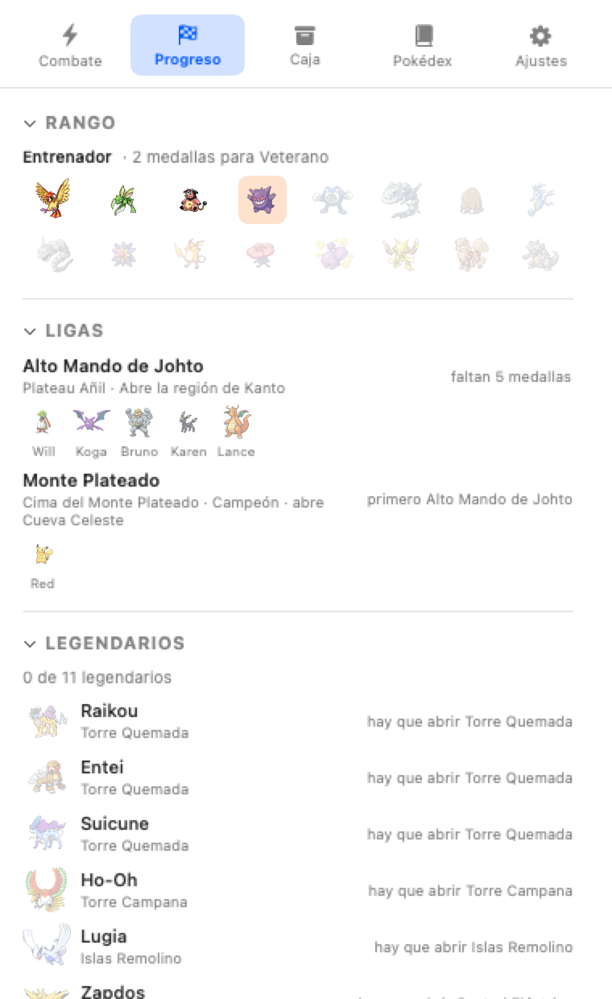
  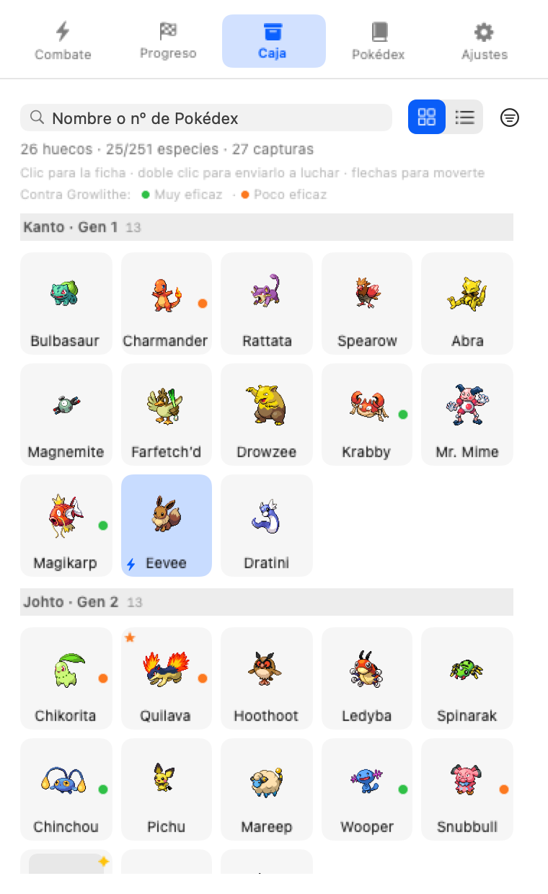
  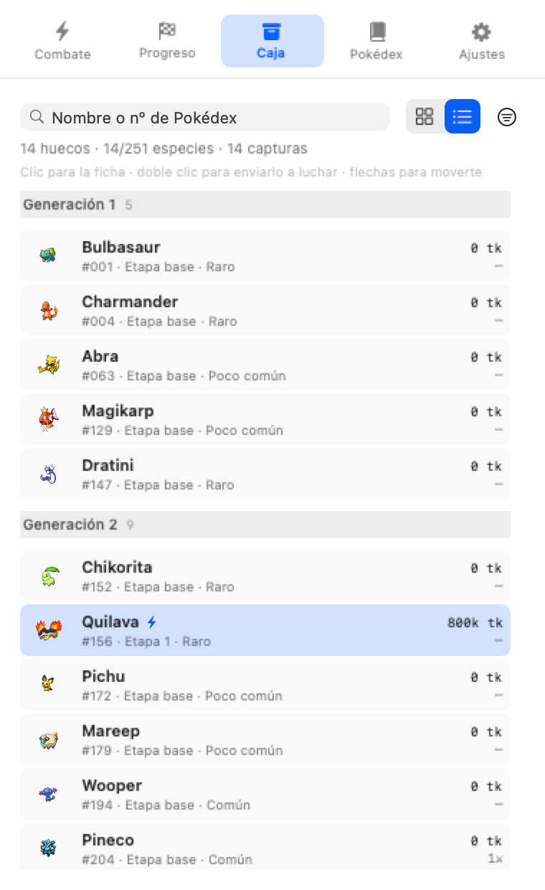
</p>

La pestaña de Progreso incluye la **escalera de desbloqueo**, que existía en los
datos pero en ninguna pantalla: qué abre cada cantidad de medallas, la puerta de
Kanto y el final, con lo alcanzado marcado. Se **deriva de los catálogos**, así
que si una zona cambia de requisito la escalera cambia con ella — no es una
tabla escrita a mano.

## 10. Tests

```bash
swift run PokeTokenBarSelfTest     # 60 tests, ~19k comprobaciones
swift run PokeTokenBar --ui-smoke-test
```

El arnés de `Sources/PokeTokenBarSelfTest` es propio y sin dependencias porque
XCTest y swift-testing necesitan Xcode completo; así la suite corre con solo las
Command Line Tools. Cubre gates de tier, ratios de aparición (200k muestras),
rangos de HP, tasa de shiny, arrastre de daño, capturas en cadena, umbrales y
ramas de evolución, idempotencia del ingest, persistencia entre reinicios,
cuarentena de estado corrupto, la tabla de tipos (incluido que ningún tipo del
dex se quede sin fila y que el multiplicador esté acotado en los 18×18×18
cruces), el apilado de la caja PC (que es lo que impide
que la lista crezca sin límite), los tramos y el recorrido con flechas de la
caja, y el parseo de transcripts y del payload HTTP.

`--ui-smoke-test` monta el árbol de SwiftUI en las tres pantallas (selector de
inicial, combate, tras captura) más el HUD, y comprueba que el panel flotante
cae dentro del área visible de la pantalla y es click-through y no opaco.

`--render-ui <carpeta>` pinta las superficies a PNG sin abrir ventanas ni
capturar la pantalla: el HUD (plegado, desplegado, de gimnasio y con medalla) y
las pestañas del popover. El smoke test mide tamaños pero no dice **dónde** cae
cada cosa; con esto se mira, y es la única forma en una máquina sin permiso de
captura de pantalla. De aquí salen las capturas del README, con estado y
semilla fijos para que se puedan regenerar iguales:

```bash
swift run PokeTokenBar --render-ui docs/screenshots
```

## 11. Regiones y ligas

El contenido va por **dos regiones con puerta entre ellas**: los ocho gimnasios
de Kanto, su Alto Mando, y solo entonces Johto.

```
Kanto: 8 gimnasios ─▶ Alto Mando de Kanto (Lorelei…Blue) ─▶ abre Johto
Johto: 8 gimnasios ─▶ Alto Mando de Johto y Red ─▶ Campeón, abre Cueva Celeste
```

**El orden es el de las generaciones** (Gen 1 y luego Gen 2), no el de Oro y
Plata. Se eligió así porque hace que **el mundo y las evoluciones cuadren**: las
evoluciones que en el canon no existían hasta Gen 2 —Steelix, Crobat, Blissey,
Scizor, Kingdra, Politoed, Bellossom, Slowking, Porygon2, Espeon y Umbreon— caen
justo detrás de la puerta, así que un Onix **no puede ser Steelix hasta abrir
Johto** (§3). Con el orden inverso esa regla no tocaba a nadie interesante.

**El noveno gimnasio no aparece hasta que sale el barco.** Sin esa puerta la
región sería solo una etiqueta, y el popover dice qué es lo que bloquea en vez
de dejar el avance en silencio.

### El barco entre regiones

El billete tiene **dos mitades**:

1. ganar el **Alto Mando de Kanto**, y
2. tener **70 de las 151 especies de Kanto registradas**.

El requisito de Pokédex es lo que hace que la región 1 haya que jugarla y no
solo atravesarla: sin él se ganaba el Alto Mando con la mitad de la región sin
ver. Son las **66 que se encuentran antes de Johto** más criar cuatro, unos
800.000 tokens, y con la zona enfocada es trabajo dirigido y no lotería.

Es el equivalente al **Dock Pass** de PokéClicker, que allí se compra con
moneda: aquí no hay monedas, así que el peaje es la Pokédex.

Dos consecuencias buenas:

- **el Alto Mando se puede ganar igual** sin el requisito. Lo que espera es el
  barco, no el contenido;
- **el salto de región puede llegar en una captura**, no solo ganando un
  combate: si ya tienes la liga, la especie número 70 abre Johto y se celebra
  como tal. Es el pago de coleccionar.

A quien ya tuviera la región 2 abierta antes de que el requisito existiera **no
se le cierra** (`grandfatheredRegions`): quitar un acceso concedido es peor que
el problema que arregla el requisito.

**La región 2 no escala el HP de sus salvajes**, y con los datos delante no le
hace falta. La rampa la ponen los jefes: la absorción va de 0,25 en Brock a 1,5
en Clair, así que los últimos gimnasios exigen ventaja de tipo **y** etapa
evolutiva. Un multiplicador por región se comería el bonus de colección ganado
en la región 1 y encarecería volver a por lo que falta.

Una liga es un **gauntlet**: sus miembros en cadena y sin salvajes en medio.
Abandonar **reinicia la tirada**, que es lo que significa un gauntlet, pero
recupera tus salvajes: nunca te secuestra la partida. Todos sus miembros
absorben 1,5 o más, así que un cruce neutro no pasa de ahí.

| Liga | Miembros | Requisito | Premio |
|---|---|---|---|
| Alto Mando de Kanto | Lorelei, Bruno, Agatha, Lance y Blue | 8 medallas | abre Johto |
| Alto Mando de Johto y Monte Plateado | Will, Koga, Bruno, Karen, Lance y **Red** | 16 medallas y la liga anterior | Campeón · abre Cueva Celeste |

Detalles canónicos que salen gratis: **Bruno aparece en los dos Altos Mandos**
(como en los juegos), **Lance** pasa de miembro en Kanto a último antes de Red,
y **Koga** es líder de gimnasio en Kanto (Weezing) y Alto Mando en Johto
(Crobat).

Qué región abre cada liga sale del **catálogo** (`LeagueReward.opensRegion`), no
de comparar el id con un nombre: eso es lo que permitió invertir el orden
tocando datos y no reglas.

### Cómo se cuentan las 16 medallas

Cada región tiene **sus ocho**, y el popover las enseña así: `KANTO 3/8` y
`JOHTO 0/8`, con la fila de Johto diciendo que está cerrada hasta ganar el Alto
Mando de Kanto. Pero **el total no se reinicia** al cambiar de región: son 16
seguidas, y es ese número el que mueve todo lo demás.

| Total | Región | Qué desbloquea |
|---|---|---|
| 0 | Kanto | rutas del sur; tier común y poco común |
| 2 | Kanto | tier **raro** (rango Entrenador) |
| 5 | Kanto | rango Veterano y la Central Eléctrica |
| 8 | Kanto | tier **legendario** (rango As), los tres pájaros y el Alto Mando |
| 8 + liga | — | **se abre Johto**: sus zonas base y su primer gimnasio |
| 10 a 16 | Johto | sus zonas por tramos (Ruinas Alfa, Monte Mortar, Senda Helada…) |
| 16 | Johto | Torre Quemada, Torre Campana e Islas Remolino: los legendarios de Johto |
| 16 + liga | — | Campeón, Cueva Celeste y el Monte Plateado |

Es decir: donde la escalera dice "10 medallas" son **las 8 de Kanto más 2 de
Johto**, no 10 de Johto. Contar por región y reiniciar en cada una (como
PokéClicker) obligaría a reescribir los requisitos de las 32 zonas y los cinco
rangos, así que se cuenta seguido y **se enseña por región**, que era donde
estaba la confusión.

## 12. Hitos legendarios

Los 11 legendarios **no aparecen en el sorteo**: tienen sitio y requisito, y se
retan cuando quieras desde la sección *Legendarios*. Su 2 % de aparición se
reparte entre los tiers que sí salen, así que el sorteo sigue sumando 1.

El sitio de cada hito **es una zona del catálogo de zonas**, así que su requisito
base es "esa zona está abierta" y no hay reglas de desbloqueo duplicadas. Encima
puede pedir medallas extra (Ho-Oh, 10) o Pokédex (Mew, 200 especies).

| Legendario | Sitio | Requisito |
|---|---|---|
| Raikou, Entei, Suicune | Torre Quemada | 8 medallas (su zona) |
| Ho-Oh · Lugia | Torre Campana · Islas Remolino | 10 medallas |
| Zapdos · Articuno · Moltres | Central Eléctrica · Islas Espuma · Calle Victoria | Kanto |
| Celebi | Bosque Encinar | 16 medallas |
| Mewtwo | Cueva Celeste | vencer a Red |
| Mew | Isla Faraway | 200 especies en la Pokédex |

Tres diferencias con un gimnasio:

- **al vencerlo sí se captura**, que es la excepción a "un jefe no se queda":
  el objetivo del juego es la Pokédex;
- **se puede abandonar**: pierdes el progreso de ese legendario pero recuperas
  tus salvajes. Un hito que te secuestra la partida hasta ganarlo sería una
  trampa, no un reto;
- **todos absorben 1,0 o más**, así que un cruce neutro no lo tumba nunca por
  muchos tokens que gastes: hace falta ventaja de tipo o una etapa más. Hay un
  test que lo fija para los once.

## 13. Zonas de caza

Una especie solo puede aparecer si alguna de sus **zonas** está abierta, y las
zonas se abren con medallas y con la región. Con 4 medallas se abren las rutas
de la costa y entran sus Pokémon; la Central Eléctrica espera a Kanto.

Eso hace legible el "¿por qué no me sale?": la ficha de la Pokédex dice dónde
vive cada uno y, si está cerrado, qué falta para abrirlo. Sustituye a que el
único gate visible fuera el tier.

El reparto **no se inventa**: sale de `/pokemon/{id}/encounters` de PokeAPI
filtrado a rojo, azul, amarillo, oro, plata y cristal. Son 163 áreas para los
251, demasiadas para ser zonas jugables, así que `tools/generate_zones.mjs` las
agrupa en 32 con reglas curadas — los encuentros son de la API, el agrupamiento
es nuestro y se revisa a mano.

La curva medida, en formas base (las únicas que aparecen en libertad):

| Progreso | Zonas | Especies | Formas base |
|---|---|---|---|
| 0 medallas | 1 | 56 | 46 |
| 4 medallas | 10 | 120 | 90 |
| Johto entero (8) | 19 | 137 | 101 |
| Kanto abierta | 23 | 163 | 109 |
| Campeón | 32 | 193 | 128 |

**Red de seguridad**: 58 especies no tienen ningún encuentro salvaje en Gen 1/2.
55 son formas evolucionadas, que aquí se consiguen evolucionando, y de las tres
restantes dos eran el bug de las cadenas con raíz fuera de rango. Queda **Mew**.
Una especie sin zona se ofrece en el tier **más difícil entre "raro" y el suyo**,
así que ninguna se vuelve incompletable por un hueco del reparto y un legendario
no se abarata a raro. Y ningún tier se queda nunca sin candidatas: si el filtro
vaciara uno, se usa el pool completo antes que dejar el combate sin rival.

### Zona enfocada: cómo se caza algo concreto

Con las zonas como desbloqueo puro, el bombo solo crece: con todas abiertas, ver
una especie **concreta** cuesta ~59 apariciones si es común, ~118 si es rara y
**~245 si es poco común** (unos 25M de tokens). Los últimos huecos de la Pokédex
eran una lotería, y peor cuanto más avanzas.

Así que una zona abierta se puede **enfocar**: mientras lo esté, el rival sale
de ella y **sale cualquiera de sus especies, a partes iguales**. Sin sortear
tier, sin filtrar por tipo ni por rareza, sin porcentajes que ajustar: la
probabilidad de la que buscas **es el tamaño de la zona**.

| Zona enfocada | Especies | Apariciones para una concreta |
|---|---|---|
| Guarida Dragón | 2 | 2 |
| Torre Quemada | 3 | 3 |
| mediana de las 33 | ~7 | ~7 |
| Rutas del sur de Johto | 46 | 46 |

Por eso la lista de zonas enseña **"faltan N de M"** (con la palabra delante: un
"41 de 45" a secas no dice si son las que tienes o las que te faltan): se ve solo que enfocar
la Guarida Dragón es un láser y enfocar las Rutas del sur no sirve de nada, sin
que nadie lo explique.

Lo que el enfoque **no** hace:

- no cuela legendarios (son hitos, no salvajes) ni formas evolucionadas (un
  salvaje arranca su línea), que es lo que nunca aparece en libertad;
- no toca el disparador del gimnasio, que cuenta **victorias** de cualquier
  sitio: volver a una zona vieja a por lo que falta nunca frena el progreso;
- no filtra por rango. Enfocar una zona con raras las da siendo Novato, y es a
  propósito: la zona ya está cerrada hasta sus medallas, así que el gate está
  antes. Con 0 medallas la única zona con raras son las Rutas del sur, y sus
  tres raras son **los iniciales**.

Se persiste: cazar algo concreto lleva sesiones.

## 14. Pokédex completa

<p align="center">
  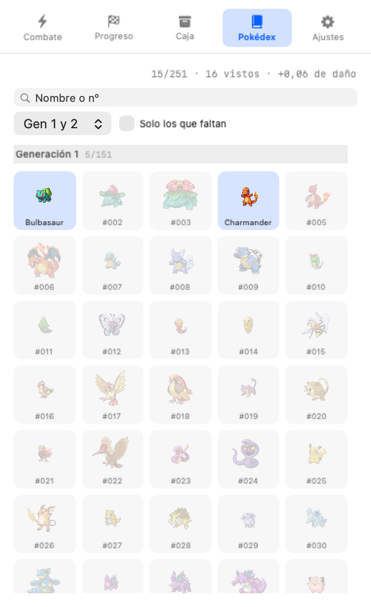
</p>

La pestaña **Pokédex** abre los **251 huecos**, no solo lo que tienes.

**Se etiqueta por región, no por generación**: la **región 1 es Kanto** (Gen 1,
#001-151) y la **2 es Johto** (Gen 2, #152-251), así que el número y el orden
de juego coinciden. Lo que sigue sorprendiendo es lo contrario: en las rutas de
Kanto se ven **especies de Johto** (un Snubbull #209 antes de abrir Johto es
normal), porque los encuentros salen de los datos de Oro y Plata, donde las dos
generaciones conviven en el mapa.


| Estado | Cómo se ve |
|---|---|
| En la caja | a color |
| Registrada | a color, algo apagada: fue tuya y evolucionó |
| Visto | en gris: le has ganado en libertad pero no se quedó |
| Sin ver | silueta y solo su número |

**La Pokédex es un registro, no una foto de la caja.** Cuenta la especie con la
que capturaste, la forma en la que se ve ahora **y todas las etapas por las que
ha pasado**. Es lo que hace que la meta exista: antes se derivaba solo de la
caja, así que un Bulbasaur que llegaba a Venusaur **borraba a Ivysaur del
contador** — y como no se repiten líneas, ese hueco no se podía volver a llenar
nunca. El contador podía bajar al progresar, y el techo real eran **215 de 251**.
Con el registro son 242.

El registro se calcula por el **camino evolutivo**, no por la forma que estaba
visible: si un evento gigante cruza dos umbrales de golpe, la forma intermedia
se apunta igual, porque el ejemplar ha pasado por ella necesariamente.

Lo que sigue sin contar es la línea entera: Blastoise está vacío hasta que tu
Wartortle llegue.

**Los 251 no son alcanzables, y la Pokédex lo dice**: 242 sí, y los otros 9 son
ramas alternativas de una misma línea (las cuatro eeveelutions que no te
tocaron, Vileplume o Bellossom, Poliwrath o Politoed, Slowbro o Slowking, y dos
de los tres Hitmon). Con un ejemplar por línea solo se puede tener una rama.

La ficha de algo que no tienes dice lo que sirve para decidir si buscarlo: tipos,
rareza, **con qué rango aparece**, su línea evolutiva, cuántas veces le has
ganado, y por qué todavía no lo tienes (le faltan medallas, o es una forma
evolucionada que no aparece en libertad).

## 15. Reiniciar partida

*Reiniciar partida…* en el pie del popover borra caja, medallas, estadísticas e
histórico de tokens. Se conservan dos cosas a propósito: los **ajustes**, que
son preferencias y no progreso, y los **ids de eventos ya procesados**, porque
si se borraran el consumo ya contabilizado podría volver a entrar como daño.

## 16. Gimnasios y medallas

<p align="center">
  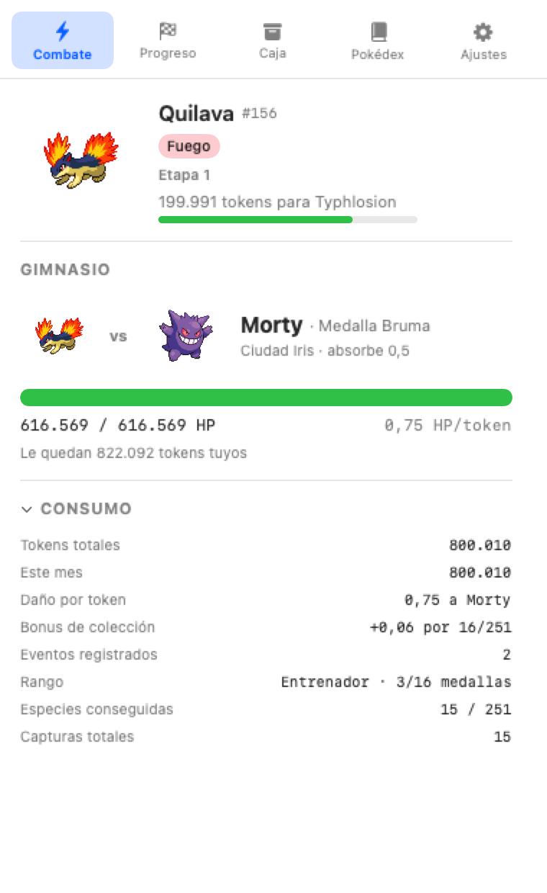
  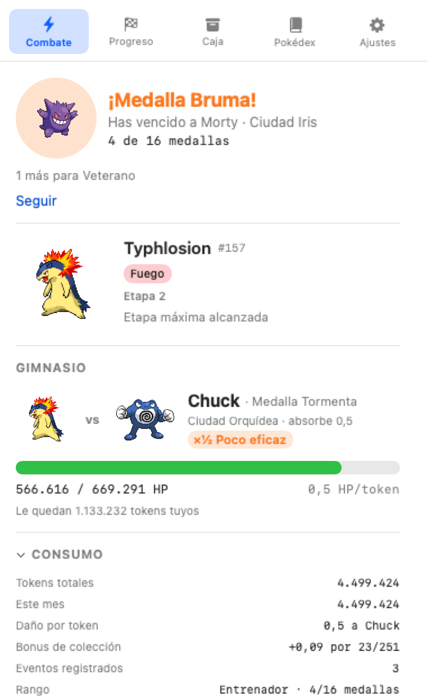
</p>
<p align="center">
  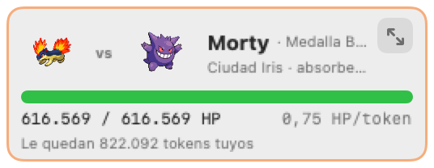
</p>

`Resources/gyms.json` es el único dato **curado a mano** del proyecto: PokeAPI
no tiene líderes de gimnasio. 16 entradas en orden de reto (los 8 de Kanto y
luego los de Johto, o sea el orden de las generaciones), cada una con su Pokémon
estrella — que es también su sprite, así que no hace falta ningún recurso
gráfico nuevo. **El orden lo fija el campo `order`, y el HP y la absorción salen
de él**: invertir las regiones fue reasignar órdenes y recalcular la rampa, no
tocar las reglas.

**El disparador**: al vencer un salvaje, si llevas 300.000 tokens o **10
victorias** desde el último gimnasio, el líder **queda disponible**. Victorias,
no capturas: cuenta igual vencer algo de una línea que ya tienes, así que
volver a una zona vieja a por lo que falta nunca frena el gimnasio.

**Y disponible es todo lo que hace: no se impone.** Entras cuando quieras con un
botón, como en una liga o en un hito —que ya funcionaban así—, y mientras no
entres sigues cazando. Antes el líder ocupaba el hueco del rival en cuanto se
cumplía el disparador, y eso tenía dos problemas: te cortaba la partida, y si el
cruce de tipos no daba, el líder **se comía los tokens sin moverse el HP** hasta
que cambiaras de compañero. Un jefe que se impone y encima cobra peaje no es un
reto. Se puede salir en cualquier momento (`Salir del gimnasio`): se pierde el
progreso contra el líder, no el disparador. No interrumpe: hay que terminar el Pokémon en curso. Los contadores se
reinician **al cerrar** el gimnasio, no al abrirlo, para que los 500k-1M tokens
del propio combate no encadenen el siguiente.

**Las medallas son el único gate de aparición**: 2 medallas abren los raros y 8
los legendarios. Acumular tokens ya no desbloquea nada (`Rarity.requiredRank`
sustituyó a los umbrales por tokens).

**El líder absorbe daño** (no se pierde, se bloquea): `daño por token = max(0, multiplicador + bonus de
etapa − absorción)`. Con un cruce insuficiente el progreso es **cero**, así que
la medalla se gana eligiendo compañero y no esperando; y como nada depende del
reloj, cerrar el Mac no cuesta progreso. La dificultad de los gimnasios tardíos
sube por absorción (0,25 → 1,5), no por HP: los nueve primeros se pueden con
cruce neutro, los últimos exigen ×2 o ×4, es decir, tener roster.

El daño se calcula contra los **tipos reales del Pokémon estrella**, no contra
el tema del gimnasio: a Onix (roca/tierra) el agua le entra ×4.

Al derrotarlo: medalla, **sin captura**, y vuelve a haber salvaje al instante.
La celebración se come el HUD durante 12 segundos con borde dorado, dice cuántas
medallas llevas y, si el rango ha subido, **qué tier acaba de desbloquear** —una
medalla que solo suma a un contador no se siente como un hito. Se cierra con
*Seguir* o se retira sola.
Si el cruce no basta, el HUD dice con qué Pokémon de tu caja sí entra y lo
equipa en un clic; los tokens se gastan igual (cuentan para el ledger y para la
evolución del compañero), simplemente no mueven la barra.

La rejilla de 16 medallas es navegable: cada una abre la ficha de su gimnasio
con el líder, su ciudad, el HP, la absorción, tu multiplicador y —si es el
siguiente— cuánto falta para que se abra.

Diseño completo y decisiones: `docs/spec-gimnasios-medallas.md`.

## 17. Regenerar el icono

`assets/AppIcon.icns` está commiteado, pero se genera:

```bash
./tools/make_icon.sh
```

Dibuja una barra de HP pixelada con AppKit y la empaqueta con `iconutil`. No
usa ningún recurso con dueño: es geometría, así que el repo puede llevarlo.

## 18. Regenerar los datos

```bash
node tools/generate_pokedex.mjs     # ~580 peticiones a PokeAPI, ~30 s
node tools/generate_typechart.mjs   # 18 peticiones
node tools/generate_zones.mjs       # 251 peticiones de encuentros, ~40 s
```

`gyms.json` no se genera: es el único dato curado a mano, porque PokeAPI no
tiene líderes de gimnasio.

## 19. Añadir una mecánica de jefe sin duplicar

Gimnasios, hitos y ligas llegaron uno detrás de otro y cada uno copió al
anterior: tres `matchup`, tres `damagePerToken`, tres `isBlocked`, tres veces la
misma secuencia de "¿está bloqueado? ¿cuántos tokens hacen falta? ¿le llega?", y
tres tarjetas con la misma barra de HP. Arreglar la fórmula eran tres sitios, y
el aviso de "no le haces nada, cambia a X" solo existía en los gimnasios porque
nadie lo copió a los otros dos.

Si añades una cuarta (revanchas, un jefe de zona, lo que sea), el camino es:

1. **Conforma a `BossOpponent`** (`opponentSpeciesID` y `absorption`). Con eso
   ya tienes `store.matchup(against:)`, `store.damagePerToken(against:)`,
   `store.isBlocked(against:)` y `store.bestCompanion(against:)` — genéricos, sin
   escribir aritmética.
2. **Resuelve el combate con `GymCombat.apply(tokens:toHP:…)`**, que devuelve
   `BossHit`: `.blocked`, `.survived(hp:)` o `.fell(spent:)`. Lo único que
   escribes es qué pasa **cuando cae**, que es lo que de verdad distingue una
   mecánica de otra (medalla, captura, siguiente miembro…).
3. **Pinta con `BossHPRow` y `BossBlockedNotice`**. La primera es la barra de HP
   con la tasa real; la segunda dice por qué está bloqueado y a quién cambiar.
4. **En el HUD, usa `panel(border:lineWidth:header:)`**, que ya trae el marco, el
   menú contextual, el mando de plegar y el revelado de métricas y caja por
   altura.

El test `las tres mecánicas de jefe comparten la fórmula` se pone rojo si alguna
vuelve a llevar su propia cuenta.

## 20. Especificaciones

Las mecánicas grandes se esbozan antes de tocar código, y los documentos se
quedan porque explican **por qué** cada regla es como es:

| Spec | Estado |
|---|---|
| `docs/spec-gimnasios-medallas.md` | implementada |
| `docs/spec-liga-zonas-hitos.md` | fases 1-4 implementadas; 5 y 6 pendientes |
| `docs/spec-ramas-y-cola.md` | ramas por condición **implementadas**; el resto (regiones, misiones, logros) sigue en borrador |
| `docs/spec-salto-a-kanto.md` | **borrador para decidir**: el requisito para abrir Kanto, si Kanto pesa más, y el momento del salto |

## 21. Límites conocidos del MVP

- Los sprites se bajan de `raw.githubusercontent.com/PokeAPI/sprites` la primera
  vez y quedan en `~/Library/Caches/PokeTokenBar/sprites`. Las **fichas usan los
  GIF animados de Gen 5**, con dos ajustes en el pie del popover: el filtro de
  escalado (pixel nítido / intermedio / suavizado — entre el pixel duro y el
  suavizado hay grados y cuál gusta es cuestión de ojo) y **dos**
  multiplicadores de tamaño (×0,75 a ×2) porque una miniatura y el sprite
  protagonista de una ficha no quieren el mismo tamaño: *Miniaturas* mueve HUD,
  caja, Pokédex y medallas, que reflowean solas, y *Ficha* mueve solo el sprite
  grande del detalle. El panel plegado del HUD crece con el de
  miniaturas, o los sprites grandes no cabrían en sus 268×104. Queda fuera la barra de menú, cuya
  altura es la que es. Los dos se acotan también al cargar, por si alguien
  edita el `state.json` a mano.
- Los GIF de las fichas se dibujan a **tamaño nativo** y se escalan por
  transformación de capa: si los escalara `NSImageView` al dibujar, el suavizado
  lo haría el dibujado y «pixel nítido» no tendría ningún efecto. (~80 KB cada uno, frente a ~2 KB del PNG), así que la
  caché crece con el uso; las rejillas siguen con el estático porque animar 251
  celdas a la vez no compensa. Si una especie no tuviera animado, cae al
  estático sola. Sin red, la app
  funciona y muestra el número de Pokédex como placeholder.
- No hay notificaciones del sistema en las capturas (evita pedir permisos): la
  barra muestra "¡X capturado!" durante 6 segundos.
- **No se repiten líneas evolutivas.** Un Squirtle salvaje sigue apareciendo
  aunque tengas un Wartortle, pero al vencerlo no se queda: cuenta como
  victoria (`familyDefeats`) y nada más. La excepción es el variocolor, que sí
  entra aunque tengas la línea en normal, porque es otra cosa a la vista.
- **Clic abre la ficha, doble clic envía a luchar.** Antes era al revés, con la
  ficha escondida en el clic derecho: mirar es lo que se hace todo el rato y
  cambiar de compañero cambia el daño por token, así que lo barato va en el
  gesto barato. El clic derecho sigue abriendo la ficha, y se captura en AppKit
  porque SwiftUI no distingue botones del ratón (solo ofrece `contextMenu`, que
  abre un menú); el detector es invisible al izquierdo para no robárselo.
- Las secciones del popover (Consumo, Rango, Ligas, Legendarios, Zonas y la
  escalera) se **pliegan tocando su cabecera**, y queda recordado: plegar algo es
  decir "esto no me interesa ahora", y reabrir la app no lo cambia.
- **Ficha grande**, en la caja, en el rival y en cada gimnasio: sprite a tamaño,
  tipos, etapa, progreso hacia la siguiente forma y sus números (combates
  ganados, gimnasios, veces vencido en libertad, cuándo se capturó). Desde ahí
  se envía a luchar, y un variocolor puede alternar a su paleta normal **si
también tienes el normal de esa línea**: con el shiny como único ejemplar,
dibujarlo en normal enseñaría un Pokémon que no está en la caja, y la caja tiene
que decir la verdad sobre lo que has conseguido.
- La caja PC apila por especie + variante + etapa alcanzada, y como no se
  repiten líneas evolutivas su techo real son **258 huecos** (129 líneas × normal
  y shiny). A ese tamaño una rejilla plana no se navega, así que la caja tiene:
  búsqueda y filtros (nombre en español o inglés, nº de Pokédex, tipo,
  generación, shiny, evolucionados), **cuatro órdenes que además parten la caja
  en tramos con cabecera pegajosa** (generación, rareza, mes de captura o banda
  de victorias), **modo lista** con los números de cada hueco a la vista, y
  **flechas** para moverse hueco a hueco (la selección respeta el filtro: nunca
  cae en algo que no se ve). La ficha va **fijada encima de la rejilla**, que se
  queda donde estaba: antes la sustituía y mirar dos Pokémon seguidos era perder
  el sitio dos veces. La búsqueda y las cabeceras quedan fuera del scroll, y la
  pestaña hace el scroll ella para no anidar dos en el mismo eje.
  El contador de la celda son las **victorias contra esa línea**: el `×N` de
  repetidos se retiró porque desde que no se capturan líneas repetidas no podía
  crecer, y por lo mismo el orden "más repetidos" pasó a ser por victorias.
  El menú del HUD lista solo los 8 grupos más recientes y enlaza a la caja
  completa. Los registros individuales sí se guardan todos (~178 bytes cada
  uno), pero no se muestran de uno en uno.
- La caja PC no permite liberar ni renombrar todavía (`nickname` ya está en el
  modelo).
- Los sprites son propiedad de Nintendo/Game Freak: **no van en el repo como
  assets**, se bajan de PokeAPI en tiempo de ejecución. El código es MIT (ver
  `LICENSE`), los sprites no. Las capturas de `docs/screenshots/` sí los
  muestran, a título ilustrativo y fuera de la licencia; se regeneran con
  `--render-ui` y no las usa la app.
